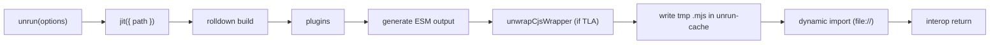
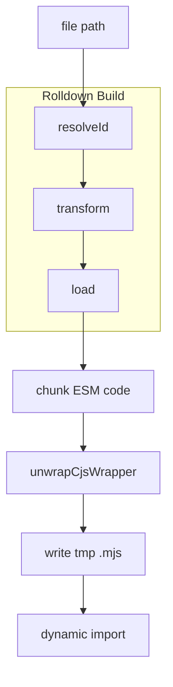
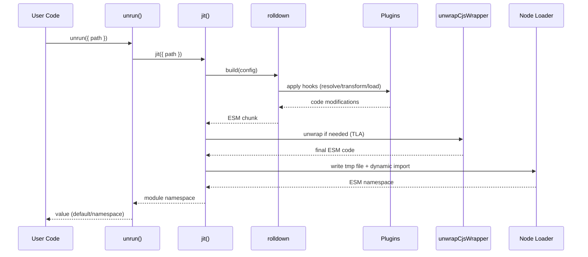

# Unrun Architecture

This document explains how the Unrun runtime loader works, why it is designed this way, and how the main components fit together. It also covers key edge cases, error handling, and how to extend the system.

## Goals

- Behave like jiti when loading source files on the fly (JS/TS/JSON), with Node ESM semantics.
- Preserve ESM and Top-Level Await (TLA); avoid whole-module CJS wrapping that would break ESM.
- Provide stable import.meta shims and support `require()` calls inside ESM via `createRequire`.
- Support TypeScript (incl. decorators) and `.cts` interop (CJS-flavored TypeScript) seamlessly.
- Keep the code modular, testable, and easy to extend with new loaders and transforms.

## High-level flow

- Entry point `unrun()` calls `jit()` with a file path.
- `jit()` composes a rolldown build with several plugins (see below), then post-processes the code.
- The final ESM code is written to a cache file and dynamically imported via `file://` for maximum Node compatibility.
- If import fails, a `unrun-debug.mjs` is written at the project root for inspection.

## Key components

### `src/utils/jit.ts`

- Orchestrates the whole runtime compilation and loading.
- Configures rolldown with `platform: 'node'`, `format: 'esm'`, `inlineDynamicImports: true`, and `onDemandWrapping: true` (for pure CJS only).
- Defines `__dirname`, `__filename`, and maps `import.meta.env` → `process.env`.
- Post-processes bundle output with `unwrapCjsWrapper`.
- Writes compiled code to a temp `.mjs` file under `${tmpdir()}/unrun-cache/<sha1>.mjs` and imports it.

### `src/plugins/esm-require-shim.ts`

Provides import.meta shims and ESM-safe `require()` support.

Why:

- Keeping ESM semantics means avoiding a full CJS wrapper. ESM code that calls `require()` must do so via `createRequire`.
- We also provide stable `import.meta` properties so code behaves consistently whether bundled or run natively.

How:

- In the `load()` hook, for ESM-looking files (those containing `import` or `export`):
  - Strip hashbangs (`#!`) to avoid parse errors.
  - Inject a prologue that defines:
    - `import.meta.filename`, `import.meta.dirname`: absolute path strings
    - `import.meta.url`: a file URL pointing to the real source file
    - `import.meta.resolve`: resolves a specifier to an absolute URL string (URL relative to the file)
  - Rewrite patterns:
    - `require(x)` → `createRequire(__unrun_filename)(x)`
    - `require.resolve(x)` → `__unrun_resolve(x)`
  - `__unrun_resolve` tries Node resolution first, then TS aliases: `.ts`, `.mts`, `.cts` (by replacing or appending extensions).

### `src/plugins/json-loader.ts`

Virtual JSON loader that emits ESM with both default and named exports.

Why:

- jiti allows importing JSON and using named exports for certain keys.

How:

- `resolveId` maps `*.json` to a virtual id `\0unrun-json:<abs>.json.mjs`.
- `load` reads the real file, sets `export default` to the parsed value, and creates named exports for identifier-like keys.

### `src/plugins/ts-transpile.ts`

TypeScript transpiler with decorator support and `.cts` interop.

Why:

- On-the-fly TS compilation is needed, including experimental decorators.
- `.cts` files compile to CJS but should be consumable as ESM.

How:

- Uses `typescript.transpileModule` (fast, no full typecheck).
- For `.ts`/`.mts`, emits ESM (ESNext) with:
  - `experimentalDecorators: true`, `emitDecoratorMetadata: true`.
- For `.cts`, emits CJS, then wraps into an ESM facade that:
  - `export default` the `module.exports` object
  - synthesizes named exports for `exports.<name> = ...` assignments

### `src/plugins/ts-extension-alias.ts`

TS extension aliasing for jiti-like resolution.

Why:

- Many codebases import TS sources through JS extensions.

How:

- In `resolveId`, map:
  - `.js → .ts`, `.mjs → .mts`, `.cjs → .cts`
- Only return the mapped path if the target file exists.

### `src/utils/unwrap-cjs.ts`

### `src/utils/source.ts`

Small shared helpers used by multiple plugins:

- `stripShebang(src)`: remove a leading hashbang while preserving line numbers.
- `isEsmLike(src)`: light heuristic to detect ESM-looking sources.
- `isValidIdentifier(name)`: validate keys when generating named JSON exports.

Unwraps rolldown `__commonJS` wrappers that would break ESM when `await` is present.

Why:

- A CJS wrapper around a body containing `await` causes "await isn't allowed in non-async function".

How:

- Scan for `var <name> = __commonJS({ ... (() => { <body> }) });`.
- If `<body>` contains `await`, splice `<body>` at top level and remove the `var ... = __commonJS(...)` statement.
- Clean up trailing `export default <name>()` and heuristic `export default require_*()` tails.

## Build pipeline and hooks

- The plugins participate in different hooks:
  - `ts-extension-alias`: resolveId
  - `ts-transpile`: transform
  - `json-loader`: resolveId, load
  - `esm-require-shim`: load

## Execution sequence

## Error handling

- On dynamic import failure, Unrun logs a message with code length and writes `unrun-debug.mjs` at the project root for quick local debugging.
- If writing to the tmp cache fails, Unrun falls back to a `data:` URL import.

## Semantics and interop

- ESM integrity: preserve TLA; avoid global CJS wrapping.
- `import.meta` shims:
  - `filename`, `dirname`: absolute path
  - `url`: file URL (always the real file, not a data URL)
  - `resolve(specifier)`: absolute href resolution relative to the file
- `require()` in ESM:
  - Rewritten to `createRequire(__unrun_filename)(...)`.
  - `require.resolve` rewritten to `__unrun_resolve`, which tries Node and then TS alias patterns.
- JSON imports: default export + named exports for identifier-like keys.
- TypeScript:
  - .ts/.mts → ESM with decorators
  - .cts → CJS compiled; wrapped as ESM with default + synthesized named exports

## Performance considerations

- Cache by content hash (sha1) under `${tmpdir()}/unrun-cache`.
- Prefer tmp file import over `data:` URL to avoid IPC serialization issues in test runners and match Node behavior better.
- Use `transpileModule` for fast TS conversion (no full typechecking).

## Extensibility

- Add a new loader/transform by creating a plugin module and plugging it into `jit.ts`.
- Keep ESM semantics in mind: prefer narrow rewrites over whole-module wrapping.
- For new file types, consider virtual modules (like the JSON loader) to control emitted ESM shape.

## Known limitations / trade-offs

- JSX support is intentionally not included (can be added later via a plugin).
- TypeScript is transpiled without type checking.
- JSON named exports are only generated for top-level keys that are valid JS identifiers.
- The `unwrapCjsWrapper` heuristic targets wrappers with TLA; if rolldown output changes shape significantly, the regex/scanner may need updates.

## Testing

- A vitest suite compares Unrun behavior to jiti across many fixtures (ESM/CJS/TS/JSON/TLA/import.meta, etc.).
- On failure, inspect `unrun-debug.mjs` to see the exact generated module code.

---

If you add features or change plugin ordering, please update this document and consider adding dedicated tests for the new behavior.
